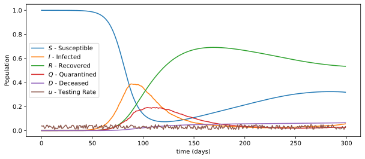

# SIRQ-Model - codes and files

This repository consists of codes and files generated while developing my Master Thesis on Applied Mathematics and Data Science.

## Abstract

Many applications have shown the use and success of classical compartment models in estimating the states and evolution of disease spreads. Similarly, the study of Optimal Control Theory has shown positive results in these scenarios but may lack computational or theoretical tractability. From this perspective, we propose a Learning-Based Model Predictive Control strategy for a susceptible-infected-recovered-quarantine (SIRQ) model for an uncertain scenario, where one has only reliable measures of the quarantined population and testing rates. We consider a Long Short-Term Memory (LSTM) model obtain a model-free predictive model, provided to a model-based control computation. We show how this kind of approach could be a viable alternative for the mitigation of epidemic disease under parameter and state uncertainty.

